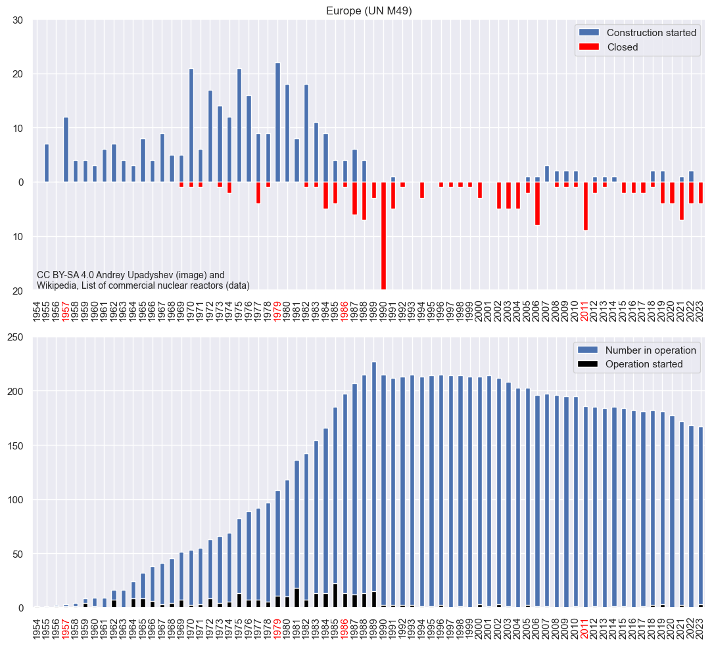
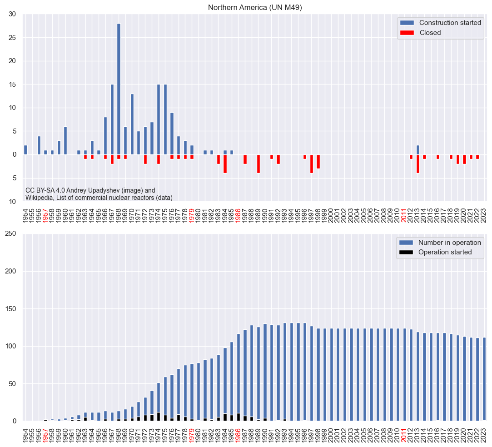
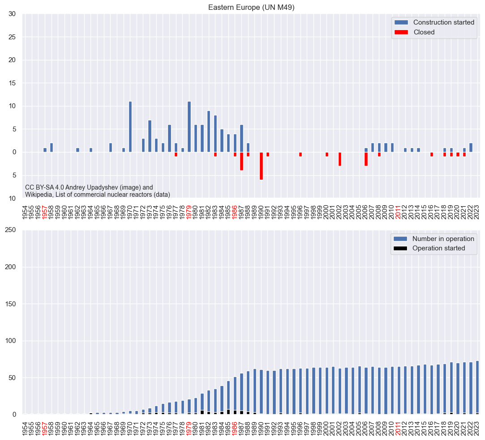
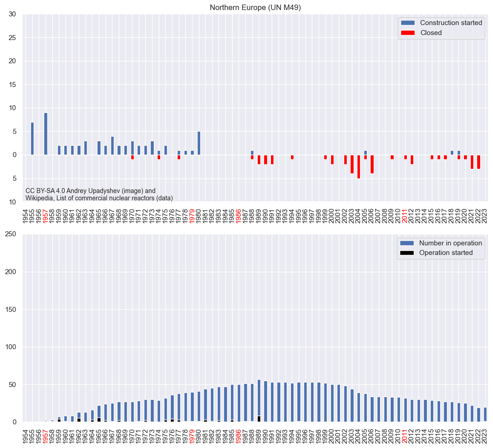
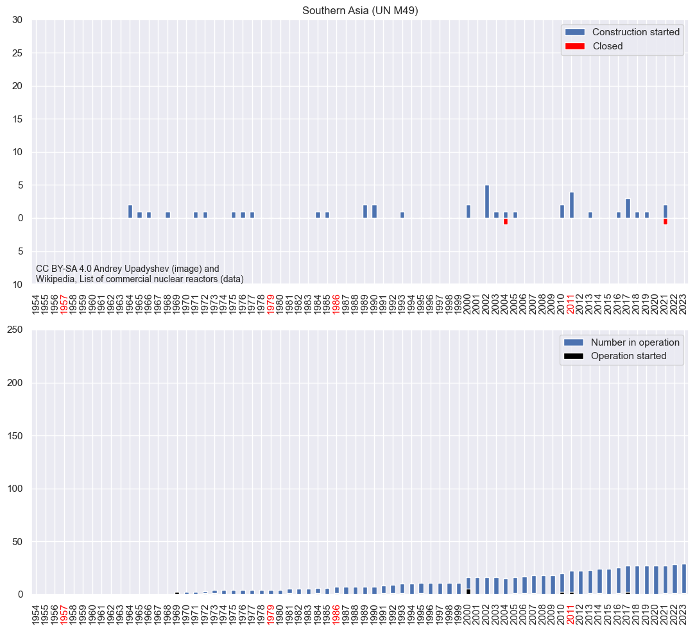
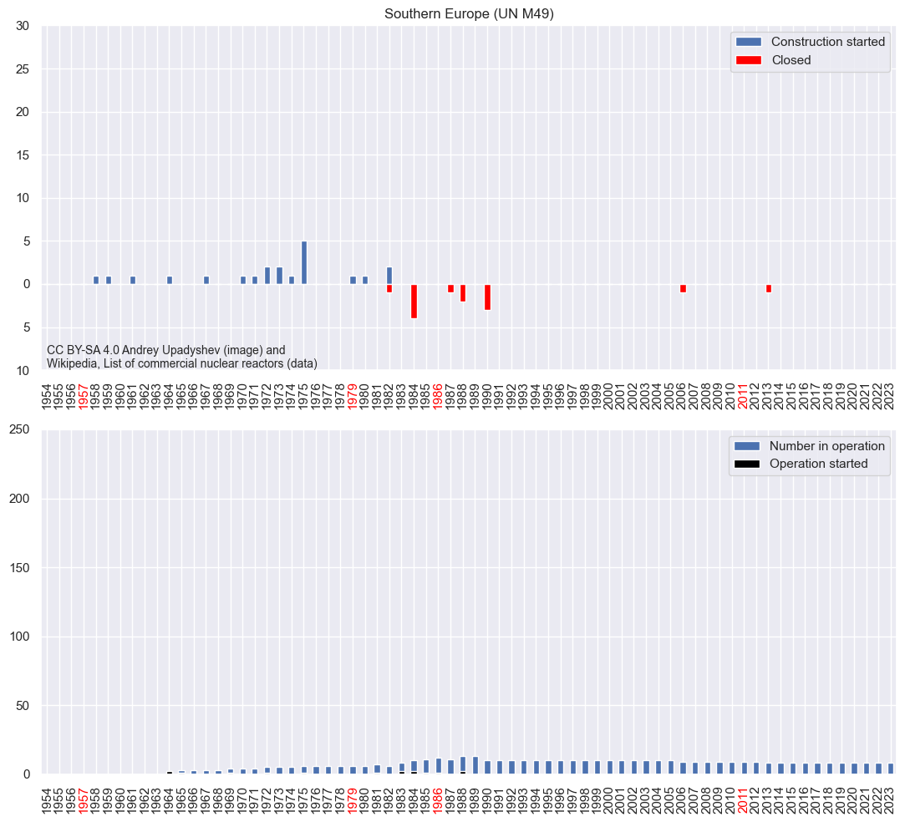
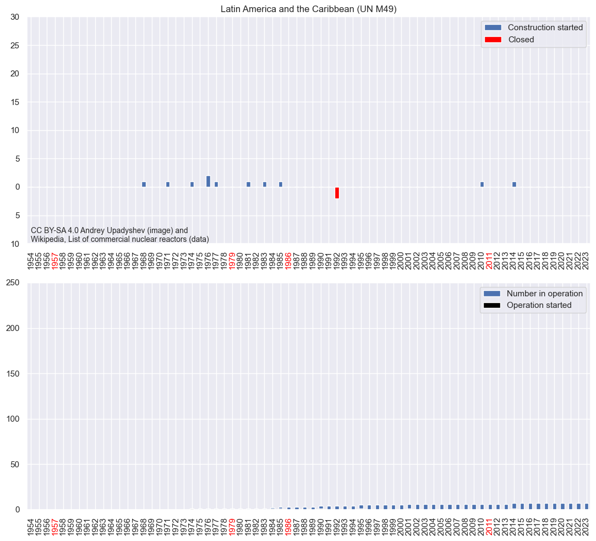
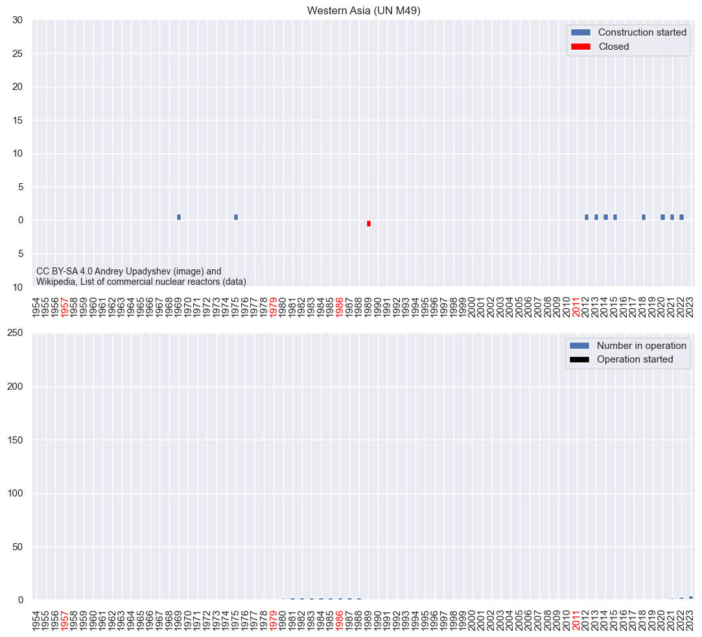
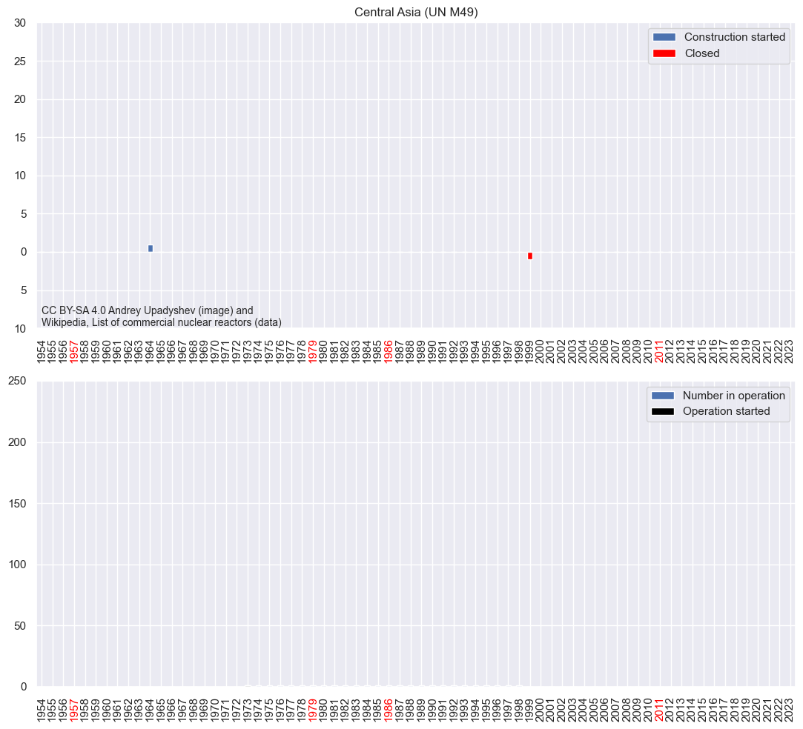
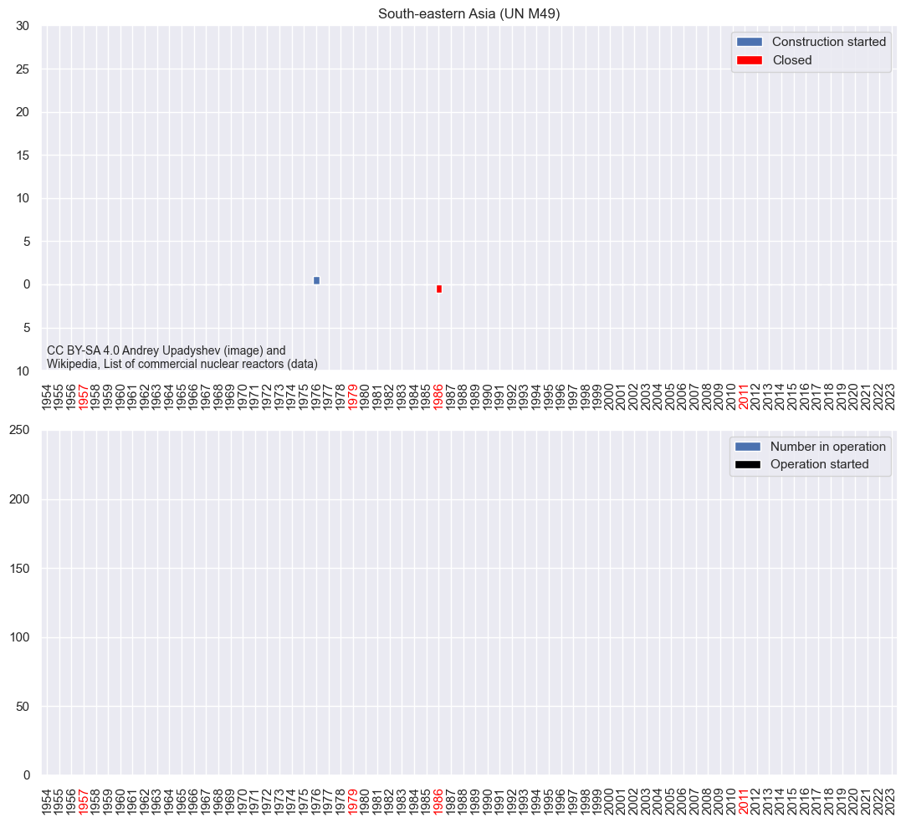

# Table of contents

- [Number of constructed and operated reactors](#operation)
    - [World stats](#operation_1)
    - [Region stats](#operation_2)
    - [Subregion stats](#operation_3)
    - [Country stats](#operation_4)
- [Never operated reactors](#never_op)
- [Construction time](#construction_time)


```python
import json
import pandas as pd
import matplotlib.pyplot as plt
import matplotlib.ticker as ticker
import datetime

import seaborn
seaborn.set_theme()

pd.set_option('future.no_silent_downcasting', True)
```


```python
with open('regions-m49.json') as f:
    regions = json.load(f)['regions']
    regions = {v: n for n, v in regions.items()}

with open('countries-m49.json') as f:
    countries = json.load(f)['countries']
    country_subregions = {c['name']: regions[c['subRegion']] for c in countries}
    country_regions = {c['name']: regions[c['region']] for c in countries}
```


```python
country_mapping = {
    'Czech Republic': 'Czechia',
    'Iran': 'Iran (Islamic Republic of)',
    'Russia': 'Russian Federation',
    'South Korea': 'Republic of Korea',
    'Taiwan': 'China',  # UN is an abomination
    'Turkey': 'T\u00fcrkiye',
    'United Kingdom': 'United Kingdom of Great Britain and Northern Ireland',
    'United States': 'United States of America',
}

max_year = 2023
years = range(1954, max_year + 1)
max_date = pd.to_datetime(datetime.date(year = max_year + 1, month = 1, day = 1))

copyright_text = 'CC BY-SA 4.0 Andrey Upadyshev (image) and\nWikipedia, List of commercial nuclear reactors (data)'
copyright_font_size = 10

def format_years_ticks(ax):
    for label in ax.get_xticklabels():
        if label.get_text() in ('1957', '1979', '1986', '2011'):
            label.set_color('red')


def format_number_plants_ticks(ax, ymin, ymax):
    def fmt(val, pos):
        return int(abs(val))
    ax.yaxis.set_major_formatter(fmt)
    ax.set_ylim(-ymin, ymax)
```


```python
orig_input_df = pd.read_csv('./reactors.csv').convert_dtypes()
for col in ('Begin building', 'Commercial operation', 'Closed'):
    orig_input_df[f'{col} date'] = pd.to_datetime(orig_input_df[col])
    orig_input_df[f'{col}'] = orig_input_df[f'{col} date'].dt.year
```


```python
input_df = orig_input_df[orig_input_df['Begin building'].notna() & (orig_input_df['Begin building'] <= max_year)].reset_index(drop=True)
input_df.loc[input_df['Commercial operation'] > max_year, 'Commercial operation'] = None
input_df.loc[input_df['Closed'] > max_year, 'Closed'] = None

input_df['SubRegion'] = input_df['Country'].map(lambda x: country_subregions[country_mapping.get(x, x)])
input_df['Region'] = input_df['Country'].map(lambda x: country_regions[country_mapping.get(x, x)])
input_df['Operated closed'] = input_df['Closed'].where(input_df['Commercial operation'].notna(), None)
input_df['Construction time'] = (input_df['Commercial operation date'] - input_df['Begin building date']).dt.total_seconds() / (365.25 * 24 * 60 * 60)
input_df
```


<div>
<style scoped>
    .dataframe tbody tr th:only-of-type {
        vertical-align: middle;
    }

    .dataframe tbody tr th {
        vertical-align: top;
    }

    .dataframe thead th {
        text-align: right;
    }
</style>
<table border="1" class="dataframe">
  <thead>
    <tr style="text-align: right;">
      <th></th>
      <th>Country</th>
      <th>Plant name</th>
      <th>Unit No.</th>
      <th>Type</th>
      <th>Model</th>
      <th>Status</th>
      <th>Capacity (MW)</th>
      <th>Begin building</th>
      <th>Commercial operation</th>
      <th>Closed</th>
      <th>Begin building date</th>
      <th>Commercial operation date</th>
      <th>Closed date</th>
      <th>SubRegion</th>
      <th>Region</th>
      <th>Operated closed</th>
      <th>Construction time</th>
    </tr>
  </thead>
  <tbody>
    <tr>
      <th>0</th>
      <td>Argentina</td>
      <td>Atucha</td>
      <td>1</td>
      <td>PHWR</td>
      <td>Siemens-KWU</td>
      <td>Operational</td>
      <td>335.0</td>
      <td>1968.0</td>
      <td>1974.0</td>
      <td>NaN</td>
      <td>1968-06-01</td>
      <td>1974-06-24</td>
      <td>NaT</td>
      <td>Latin America and the Caribbean</td>
      <td>Americas</td>
      <td>NaN</td>
      <td>6.061602</td>
    </tr>
    <tr>
      <th>1</th>
      <td>Argentina</td>
      <td>Atucha</td>
      <td>2</td>
      <td>PHWR</td>
      <td>Siemens-KWU</td>
      <td>Operational</td>
      <td>692.0</td>
      <td>1981.0</td>
      <td>2014.0</td>
      <td>NaN</td>
      <td>1981-07-14</td>
      <td>2014-06-27</td>
      <td>NaT</td>
      <td>Latin America and the Caribbean</td>
      <td>Americas</td>
      <td>NaN</td>
      <td>32.952772</td>
    </tr>
    <tr>
      <th>2</th>
      <td>Argentina</td>
      <td>Embalse</td>
      <td>1</td>
      <td>PHWR</td>
      <td>CANDU-6</td>
      <td>Operational</td>
      <td>600.0</td>
      <td>1974.0</td>
      <td>1984.0</td>
      <td>NaN</td>
      <td>1974-04-01</td>
      <td>1984-01-20</td>
      <td>NaT</td>
      <td>Latin America and the Caribbean</td>
      <td>Americas</td>
      <td>NaN</td>
      <td>9.804244</td>
    </tr>
    <tr>
      <th>3</th>
      <td>Argentina</td>
      <td>CAREM</td>
      <td>1</td>
      <td>PWR</td>
      <td>CAREM25</td>
      <td>Under construction</td>
      <td>25.0</td>
      <td>2014.0</td>
      <td>NaN</td>
      <td>NaN</td>
      <td>2014-02-08</td>
      <td>NaT</td>
      <td>NaT</td>
      <td>Latin America and the Caribbean</td>
      <td>Americas</td>
      <td>NaN</td>
      <td>NaN</td>
    </tr>
    <tr>
      <th>4</th>
      <td>Armenia</td>
      <td>Metsamor</td>
      <td>1</td>
      <td>PWR</td>
      <td>VVER-440/V-270</td>
      <td>Shut down</td>
      <td>376.0</td>
      <td>1969.0</td>
      <td>1977.0</td>
      <td>1989.0</td>
      <td>1969-07-01</td>
      <td>1977-10-06</td>
      <td>1989-02-25</td>
      <td>Western Asia</td>
      <td>Asia</td>
      <td>1989.0</td>
      <td>8.265572</td>
    </tr>
    <tr>
      <th>...</th>
      <td>...</td>
      <td>...</td>
      <td>...</td>
      <td>...</td>
      <td>...</td>
      <td>...</td>
      <td>...</td>
      <td>...</td>
      <td>...</td>
      <td>...</td>
      <td>...</td>
      <td>...</td>
      <td>...</td>
      <td>...</td>
      <td>...</td>
      <td>...</td>
      <td>...</td>
    </tr>
    <tr>
      <th>746</th>
      <td>United States</td>
      <td>Watts Bar</td>
      <td>2</td>
      <td>PWR</td>
      <td>WH 4-Loop (ICECOND)</td>
      <td>Operational</td>
      <td>1164.0</td>
      <td>1973.0</td>
      <td>2016.0</td>
      <td>NaN</td>
      <td>1973-09-01</td>
      <td>2016-06-04</td>
      <td>NaT</td>
      <td>Northern America</td>
      <td>Americas</td>
      <td>NaN</td>
      <td>42.757016</td>
    </tr>
    <tr>
      <th>747</th>
      <td>United States</td>
      <td>Wolf Creek</td>
      <td>1</td>
      <td>PWR</td>
      <td>WH 4-Loop (DRY)</td>
      <td>Operational</td>
      <td>1200.0</td>
      <td>1977.0</td>
      <td>1985.0</td>
      <td>NaN</td>
      <td>1977-05-31</td>
      <td>1985-09-03</td>
      <td>NaT</td>
      <td>Northern America</td>
      <td>Americas</td>
      <td>NaN</td>
      <td>8.260096</td>
    </tr>
    <tr>
      <th>748</th>
      <td>United States</td>
      <td>Yankee Rowe</td>
      <td>1</td>
      <td>PWR</td>
      <td>WH (DRY)</td>
      <td>Dismantled</td>
      <td>167.0</td>
      <td>1957.0</td>
      <td>1961.0</td>
      <td>1991.0</td>
      <td>1957-11-01</td>
      <td>1961-07-01</td>
      <td>1991-10-01</td>
      <td>Northern America</td>
      <td>Americas</td>
      <td>1991.0</td>
      <td>3.663244</td>
    </tr>
    <tr>
      <th>749</th>
      <td>United States</td>
      <td>Zion</td>
      <td>1</td>
      <td>PWR</td>
      <td>WH (DRY)</td>
      <td>Dismantled</td>
      <td>1040.0</td>
      <td>1968.0</td>
      <td>1973.0</td>
      <td>1998.0</td>
      <td>1968-12-01</td>
      <td>1973-12-31</td>
      <td>1998-02-13</td>
      <td>Northern America</td>
      <td>Americas</td>
      <td>1998.0</td>
      <td>5.081451</td>
    </tr>
    <tr>
      <th>750</th>
      <td>United States</td>
      <td>Zion</td>
      <td>2</td>
      <td>PWR</td>
      <td>WH (DRY)</td>
      <td>Dismantled</td>
      <td>1040.0</td>
      <td>1968.0</td>
      <td>1974.0</td>
      <td>1998.0</td>
      <td>1968-12-01</td>
      <td>1974-09-17</td>
      <td>1998-02-13</td>
      <td>Northern America</td>
      <td>Americas</td>
      <td>1998.0</td>
      <td>5.793292</td>
    </tr>
  </tbody>
</table>
<p>751 rows × 17 columns</p>
</div>


```python
total_constructed_by_subregion = input_df.groupby(['SubRegion', 'Region'])[['Begin building', 'Commercial operation', 'Closed']].count().reset_index().sort_values('Begin building', ascending=False).reset_index(drop=True)
total_constructed_by_subregion
```


<div>
<style scoped>
    .dataframe tbody tr th:only-of-type {
        vertical-align: middle;
    }

    .dataframe tbody tr th {
        vertical-align: top;
    }

    .dataframe thead th {
        text-align: right;
    }
</style>
<table border="1" class="dataframe">
  <thead>
    <tr style="text-align: right;">
      <th></th>
      <th>SubRegion</th>
      <th>Region</th>
      <th>Begin building</th>
      <th>Commercial operation</th>
      <th>Closed</th>
    </tr>
  </thead>
  <tbody>
    <tr>
      <th>0</th>
      <td>Eastern Asia</td>
      <td>Asia</td>
      <td>181</td>
      <td>147</td>
      <td>34</td>
    </tr>
    <tr>
      <th>1</th>
      <td>Northern America</td>
      <td>Americas</td>
      <td>165</td>
      <td>159</td>
      <td>52</td>
    </tr>
    <tr>
      <th>2</th>
      <td>Western Europe</td>
      <td>Europe</td>
      <td>125</td>
      <td>120</td>
      <td>58</td>
    </tr>
    <tr>
      <th>3</th>
      <td>Eastern Europe</td>
      <td>Europe</td>
      <td>122</td>
      <td>94</td>
      <td>29</td>
    </tr>
    <tr>
      <th>4</th>
      <td>Northern Europe</td>
      <td>Europe</td>
      <td>67</td>
      <td>64</td>
      <td>45</td>
    </tr>
    <tr>
      <th>5</th>
      <td>Southern Asia</td>
      <td>Asia</td>
      <td>42</td>
      <td>31</td>
      <td>2</td>
    </tr>
    <tr>
      <th>6</th>
      <td>Southern Europe</td>
      <td>Europe</td>
      <td>21</td>
      <td>15</td>
      <td>13</td>
    </tr>
    <tr>
      <th>7</th>
      <td>Latin America and the Caribbean</td>
      <td>Americas</td>
      <td>11</td>
      <td>7</td>
      <td>2</td>
    </tr>
    <tr>
      <th>8</th>
      <td>Western Asia</td>
      <td>Asia</td>
      <td>10</td>
      <td>5</td>
      <td>1</td>
    </tr>
    <tr>
      <th>9</th>
      <td>Northern Africa</td>
      <td>Africa</td>
      <td>3</td>
      <td>0</td>
      <td>0</td>
    </tr>
    <tr>
      <th>10</th>
      <td>Sub-Saharan Africa</td>
      <td>Africa</td>
      <td>2</td>
      <td>2</td>
      <td>0</td>
    </tr>
    <tr>
      <th>11</th>
      <td>Central Asia</td>
      <td>Asia</td>
      <td>1</td>
      <td>1</td>
      <td>1</td>
    </tr>
    <tr>
      <th>12</th>
      <td>South-eastern Asia</td>
      <td>Asia</td>
      <td>1</td>
      <td>0</td>
      <td>1</td>
    </tr>
  </tbody>
</table>
</div>


```python
total_constructed_by_country = input_df.groupby(['Country', 'SubRegion', 'Region'])[['Begin building', 'Commercial operation', 'Closed']].count().reset_index().sort_values('Begin building', ascending=False).reset_index(drop=True)
total_constructed_by_country
```


<div>
<style scoped>
    .dataframe tbody tr th:only-of-type {
        vertical-align: middle;
    }

    .dataframe tbody tr th {
        vertical-align: top;
    }

    .dataframe thead th {
        text-align: right;
    }
</style>
<table border="1" class="dataframe">
  <thead>
    <tr style="text-align: right;">
      <th></th>
      <th>Country</th>
      <th>SubRegion</th>
      <th>Region</th>
      <th>Begin building</th>
      <th>Commercial operation</th>
      <th>Closed</th>
    </tr>
  </thead>
  <tbody>
    <tr>
      <th>0</th>
      <td>United States</td>
      <td>Northern America</td>
      <td>Americas</td>
      <td>140</td>
      <td>134</td>
      <td>46</td>
    </tr>
    <tr>
      <th>1</th>
      <td>China</td>
      <td>Eastern Asia</td>
      <td>Asia</td>
      <td>81</td>
      <td>55</td>
      <td>0</td>
    </tr>
    <tr>
      <th>2</th>
      <td>France</td>
      <td>Western Europe</td>
      <td>Europe</td>
      <td>69</td>
      <td>68</td>
      <td>12</td>
    </tr>
    <tr>
      <th>3</th>
      <td>Japan</td>
      <td>Eastern Asia</td>
      <td>Asia</td>
      <td>62</td>
      <td>59</td>
      <td>26</td>
    </tr>
    <tr>
      <th>4</th>
      <td>Russia</td>
      <td>Eastern Europe</td>
      <td>Europe</td>
      <td>62</td>
      <td>47</td>
      <td>10</td>
    </tr>
    <tr>
      <th>5</th>
      <td>United Kingdom</td>
      <td>Northern Europe</td>
      <td>Europe</td>
      <td>46</td>
      <td>44</td>
      <td>35</td>
    </tr>
    <tr>
      <th>6</th>
      <td>Germany</td>
      <td>Western Europe</td>
      <td>Europe</td>
      <td>39</td>
      <td>36</td>
      <td>39</td>
    </tr>
    <tr>
      <th>7</th>
      <td>India</td>
      <td>Southern Asia</td>
      <td>Asia</td>
      <td>31</td>
      <td>23</td>
      <td>1</td>
    </tr>
    <tr>
      <th>8</th>
      <td>South Korea</td>
      <td>Eastern Asia</td>
      <td>Asia</td>
      <td>30</td>
      <td>27</td>
      <td>2</td>
    </tr>
    <tr>
      <th>9</th>
      <td>Canada</td>
      <td>Northern America</td>
      <td>Americas</td>
      <td>25</td>
      <td>25</td>
      <td>6</td>
    </tr>
    <tr>
      <th>10</th>
      <td>Ukraine</td>
      <td>Eastern Europe</td>
      <td>Europe</td>
      <td>25</td>
      <td>19</td>
      <td>8</td>
    </tr>
    <tr>
      <th>11</th>
      <td>Sweden</td>
      <td>Northern Europe</td>
      <td>Europe</td>
      <td>14</td>
      <td>13</td>
      <td>8</td>
    </tr>
    <tr>
      <th>12</th>
      <td>Spain</td>
      <td>Southern Europe</td>
      <td>Europe</td>
      <td>14</td>
      <td>10</td>
      <td>7</td>
    </tr>
    <tr>
      <th>13</th>
      <td>Slovakia</td>
      <td>Eastern Europe</td>
      <td>Europe</td>
      <td>9</td>
      <td>8</td>
      <td>3</td>
    </tr>
    <tr>
      <th>14</th>
      <td>Belgium</td>
      <td>Western Europe</td>
      <td>Europe</td>
      <td>8</td>
      <td>8</td>
      <td>3</td>
    </tr>
    <tr>
      <th>15</th>
      <td>Bulgaria</td>
      <td>Eastern Europe</td>
      <td>Europe</td>
      <td>8</td>
      <td>6</td>
      <td>4</td>
    </tr>
    <tr>
      <th>16</th>
      <td>Taiwan</td>
      <td>Eastern Asia</td>
      <td>Asia</td>
      <td>8</td>
      <td>6</td>
      <td>6</td>
    </tr>
    <tr>
      <th>17</th>
      <td>Pakistan</td>
      <td>Southern Asia</td>
      <td>Asia</td>
      <td>7</td>
      <td>7</td>
      <td>1</td>
    </tr>
    <tr>
      <th>18</th>
      <td>Italy</td>
      <td>Southern Europe</td>
      <td>Europe</td>
      <td>6</td>
      <td>4</td>
      <td>6</td>
    </tr>
    <tr>
      <th>19</th>
      <td>Switzerland</td>
      <td>Western Europe</td>
      <td>Europe</td>
      <td>6</td>
      <td>6</td>
      <td>2</td>
    </tr>
    <tr>
      <th>20</th>
      <td>Czech Republic</td>
      <td>Eastern Europe</td>
      <td>Europe</td>
      <td>6</td>
      <td>6</td>
      <td>0</td>
    </tr>
    <tr>
      <th>21</th>
      <td>Finland</td>
      <td>Northern Europe</td>
      <td>Europe</td>
      <td>5</td>
      <td>5</td>
      <td>0</td>
    </tr>
    <tr>
      <th>22</th>
      <td>Turkey</td>
      <td>Western Asia</td>
      <td>Asia</td>
      <td>4</td>
      <td>0</td>
      <td>0</td>
    </tr>
    <tr>
      <th>23</th>
      <td>United Arab Emirates</td>
      <td>Western Asia</td>
      <td>Asia</td>
      <td>4</td>
      <td>3</td>
      <td>0</td>
    </tr>
    <tr>
      <th>24</th>
      <td>Argentina</td>
      <td>Latin America and the Caribbean</td>
      <td>Americas</td>
      <td>4</td>
      <td>3</td>
      <td>0</td>
    </tr>
    <tr>
      <th>25</th>
      <td>Belarus</td>
      <td>Eastern Europe</td>
      <td>Europe</td>
      <td>4</td>
      <td>2</td>
      <td>2</td>
    </tr>
    <tr>
      <th>26</th>
      <td>Hungary</td>
      <td>Eastern Europe</td>
      <td>Europe</td>
      <td>4</td>
      <td>4</td>
      <td>0</td>
    </tr>
    <tr>
      <th>27</th>
      <td>Brazil</td>
      <td>Latin America and the Caribbean</td>
      <td>Americas</td>
      <td>3</td>
      <td>2</td>
      <td>0</td>
    </tr>
    <tr>
      <th>28</th>
      <td>Egypt</td>
      <td>Northern Africa</td>
      <td>Africa</td>
      <td>3</td>
      <td>0</td>
      <td>0</td>
    </tr>
    <tr>
      <th>29</th>
      <td>Netherlands</td>
      <td>Western Europe</td>
      <td>Europe</td>
      <td>2</td>
      <td>2</td>
      <td>1</td>
    </tr>
    <tr>
      <th>30</th>
      <td>Armenia</td>
      <td>Western Asia</td>
      <td>Asia</td>
      <td>2</td>
      <td>2</td>
      <td>1</td>
    </tr>
    <tr>
      <th>31</th>
      <td>Bangladesh</td>
      <td>Southern Asia</td>
      <td>Asia</td>
      <td>2</td>
      <td>0</td>
      <td>0</td>
    </tr>
    <tr>
      <th>32</th>
      <td>Cuba</td>
      <td>Latin America and the Caribbean</td>
      <td>Americas</td>
      <td>2</td>
      <td>0</td>
      <td>2</td>
    </tr>
    <tr>
      <th>33</th>
      <td>Iran</td>
      <td>Southern Asia</td>
      <td>Asia</td>
      <td>2</td>
      <td>1</td>
      <td>0</td>
    </tr>
    <tr>
      <th>34</th>
      <td>South Africa</td>
      <td>Sub-Saharan Africa</td>
      <td>Africa</td>
      <td>2</td>
      <td>2</td>
      <td>0</td>
    </tr>
    <tr>
      <th>35</th>
      <td>Lithuania</td>
      <td>Northern Europe</td>
      <td>Europe</td>
      <td>2</td>
      <td>2</td>
      <td>2</td>
    </tr>
    <tr>
      <th>36</th>
      <td>Mexico</td>
      <td>Latin America and the Caribbean</td>
      <td>Americas</td>
      <td>2</td>
      <td>2</td>
      <td>0</td>
    </tr>
    <tr>
      <th>37</th>
      <td>Romania</td>
      <td>Eastern Europe</td>
      <td>Europe</td>
      <td>2</td>
      <td>2</td>
      <td>0</td>
    </tr>
    <tr>
      <th>38</th>
      <td>Poland</td>
      <td>Eastern Europe</td>
      <td>Europe</td>
      <td>2</td>
      <td>0</td>
      <td>2</td>
    </tr>
    <tr>
      <th>39</th>
      <td>Philippines</td>
      <td>South-eastern Asia</td>
      <td>Asia</td>
      <td>1</td>
      <td>0</td>
      <td>1</td>
    </tr>
    <tr>
      <th>40</th>
      <td>Slovenia</td>
      <td>Southern Europe</td>
      <td>Europe</td>
      <td>1</td>
      <td>1</td>
      <td>0</td>
    </tr>
    <tr>
      <th>41</th>
      <td>Austria</td>
      <td>Western Europe</td>
      <td>Europe</td>
      <td>1</td>
      <td>0</td>
      <td>1</td>
    </tr>
    <tr>
      <th>42</th>
      <td>Kazakhstan</td>
      <td>Central Asia</td>
      <td>Asia</td>
      <td>1</td>
      <td>1</td>
      <td>1</td>
    </tr>
  </tbody>
</table>
</div>


<a id="operation"></a>
# Number of constructed and operated reactors

<a id="operation_1"></a>
## World stats


```python
num_building_started = input_df.groupby(['Begin building'])['Begin building'].count()
num_connected = input_df.groupby(['Commercial operation'])['Commercial operation'].count()
num_closed = input_df.groupby(['Closed'])['Closed'].count()
num_operated_closed = input_df.groupby(['Operated closed'])['Operated closed'].count()

max_building_started = num_building_started.max()
max_num_closed = num_closed.max()
ymax = (max_building_started + 4) // 5 * 5
ymin = (max_num_closed + 4) // 5 * 5

combined = pd.concat([
        num_building_started,
        num_connected,
        num_closed,
        num_operated_closed,
    ], axis=1)

combined = combined.reindex(years, fill_value=0)

combined['Commercial operation tot'] = combined['Commercial operation'].fillna(0).cumsum()
combined['Operated closed tot'] = combined['Operated closed'].fillna(0).cumsum()
combined['In operation'] = combined['Commercial operation tot'] - combined['Operated closed tot']

fig, ax = plt.subplots(2, 1, figsize=(11, 10))

ax1, ax2 = ax

combined['Begin building'].plot.bar(ax=ax1, label='Construction started')
(-combined['Closed']).plot.bar(ax=ax1, color='red', label='Closed')

title = 'World'
print(f'{title}:')
ax1.set_title(title)
ax1.set_xlabel(None)
format_years_ticks(ax1)
format_number_plants_ticks(ax1, ymin, ymax)
ax1.text(0, -ymin, copyright_text, fontsize=copyright_font_size, verticalalignment='bottom')
ax1.legend()

combined['In operation'].plot.bar(ax=ax2, label='Number in operation')
combined['Commercial operation'].plot.bar(ax=ax2, color='black', label='Operation started')
format_years_ticks(ax2)
#ax2.text(0, ax2.get_ylim()[1], copyright_text, fontsize=copyright_font_size, verticalalignment='top')
ax2.legend()

fig.tight_layout()
plt.show()
```

    World:


    

    


<a id="operation_2"></a>
## Region stats


```python
total_constructed_by_region = input_df.groupby(['Region'])[['Begin building', 'Commercial operation', 'Closed']].count().reset_index().sort_values('Begin building', ascending=False).reset_index(drop=True)

num_building_started = input_df.groupby(['Region', 'Begin building'])['Begin building'].count()
num_connected = input_df.groupby(['Region', 'Commercial operation'])['Commercial operation'].count()
num_closed = input_df.groupby(['Region', 'Closed'])['Closed'].count()
num_operated_closed = input_df.groupby(['Region', 'Operated closed'])['Operated closed'].count()

#top_regions = total_constructed_by_region[total_constructed_by_region['Begin building'] > 10]['Region'].to_list()
top_regions = total_constructed_by_region['Region'].to_list()

regions = sorted(c for c in input_df['Region'].unique() if c in num_building_started)

max_building_started = num_building_started.max()
max_num_closed = num_closed.max()
ymax = (max_building_started + 4) // 5 * 5
ymin = (max_num_closed + 4) // 5 * 5
tot_ymax_regions = 250  # TODO: calculate from data


for c in top_regions:
    combined = pd.concat([
        num_building_started[c],
        num_connected[c] if c in num_connected else pd.DataFrame(columns=['Commercial operation']),
        num_closed[c] if c in num_closed else pd.DataFrame(columns=['Closed']),
        num_operated_closed[c] if c in num_operated_closed else pd.DataFrame(columns=['Operated closed']),
    ], axis=1)
    
    combined = combined.reindex(years, fill_value=0)

    combined['Commercial operation tot'] = combined['Commercial operation'].fillna(0).cumsum()
    combined['Operated closed tot'] = combined['Operated closed'].fillna(0).cumsum()
    combined['In operation'] = combined['Commercial operation tot'] - combined['Operated closed tot']

    fig, ax = plt.subplots(2, 1, figsize=(11, 10))

    ax1, ax2 = ax

    combined['Begin building'].plot.bar(ax=ax1, label='Construction started')
    (-combined['Closed']).plot.bar(ax=ax1, color='red', label='Closed')

    title = f'{c} (UN M49)'
    print(f'{title}:')
    ax1.set_title(title)
    ax1.set_xlabel(None)
    format_years_ticks(ax1)
    format_number_plants_ticks(ax1, ymin, ymax)
    ax1.text(0, -ymin, copyright_text, fontsize=copyright_font_size, verticalalignment='bottom')
    ax1.legend()

    combined['In operation'].plot.bar(ax=ax2, label='Number in operation')
    combined['Commercial operation'].plot.bar(ax=ax2, color='black', label='Operation started')
    format_years_ticks(ax2)
    ax2.set_ylim(0, tot_ymax_regions)
    #ax2.text(0, ax2.get_ylim()[1], copyright_text, fontsize=copyright_font_size, verticalalignment='top')
    ax2.legend()


    fig.tight_layout()
    plt.show()
```

    Europe (UN M49):


    

    


    Asia (UN M49):


    

    


    Americas (UN M49):


    

    


    Africa (UN M49):


    

    


```python
europe_df = input_df[(input_df['Region'] == 'Europe') & (input_df['SubRegion'] != 'Eastern Europe') & (input_df['SubRegion'] != 'Lithuania')]
num_building_started = europe_df.groupby(['Begin building'])['Begin building'].count()
num_connected = europe_df.groupby(['Commercial operation'])['Commercial operation'].count()
num_closed = europe_df.groupby(['Closed'])['Closed'].count()
num_operated_closed = europe_df.groupby(['Operated closed'])['Operated closed'].count()

max_building_started = num_building_started.max()
max_num_closed = num_closed.max()
ymax = (max_building_started + 4) // 5 * 5
ymin = (max_num_closed + 4) // 5 * 5

combined = pd.concat([
        num_building_started,
        num_connected,
        num_closed,
        num_operated_closed,
    ], axis=1)

combined = combined.reindex(years, fill_value=0)

combined['Commercial operation tot'] = combined['Commercial operation'].fillna(0).cumsum()
combined['Operated closed tot'] = combined['Operated closed'].fillna(0).cumsum()
combined['In operation'] = combined['Commercial operation tot'] - combined['Operated closed tot']

fig, ax = plt.subplots(2, 1, figsize=(11, 10))

ax1, ax2 = ax

combined['Begin building'].plot.bar(ax=ax1, label='Construction started')
(-combined['Closed']).plot.bar(ax=ax1, color='red', label='Closed')

title = 'Europe excluding Eastern Europe and ex-USSR countries'
print(f'{title}:')
ax1.set_title(title)
ax1.set_xlabel(None)
format_years_ticks(ax1)
format_number_plants_ticks(ax1, ymin, ymax)
ax1.text(0, -ymin, copyright_text, fontsize=copyright_font_size, verticalalignment='bottom')
ax1.legend()

combined['In operation'].plot.bar(ax=ax2, label='Number in operation')
combined['Commercial operation'].plot.bar(ax=ax2, color='black', label='Operation started')
format_years_ticks(ax2)
ax2.set_ylim(0, tot_ymax_regions)
#ax2.text(0, ax2.get_ylim()[1], copyright_text, fontsize=copyright_font_size, verticalalignment='top')
ax2.legend()

fig.tight_layout()
plt.show()
```

    Europe excluding Eastern Europe and ex-USSR countries:


    

    


<a id="operation_3"></a>
## Subregion stats


```python
num_building_started = input_df.groupby(['SubRegion', 'Begin building'])['Begin building'].count()
num_connected = input_df.groupby(['SubRegion', 'Commercial operation'])['Commercial operation'].count()
num_closed = input_df.groupby(['SubRegion', 'Closed'])['Closed'].count()
num_operated_closed = input_df.groupby(['SubRegion', 'Operated closed'])['Operated closed'].count()

sub_regions = sorted(c for c in input_df['SubRegion'].unique() if c in num_building_started)
#top_regions = total_constructed_by_subregion[total_constructed_by_subregion['Begin building'] > 10]['SubRegion'].to_list()
top_regions = total_constructed_by_subregion['SubRegion'].to_list()

max_building_started = num_building_started.max()
max_num_closed = num_closed.max()
ymax = (max_building_started + 4) // 5 * 5
ymin = (max_num_closed + 4) // 5 * 5


for c in top_regions:
    combined = pd.concat([
        num_building_started[c],
        num_connected[c] if c in num_connected else pd.DataFrame(columns=['Commercial operation']),
        num_closed[c] if c in num_closed else pd.DataFrame(columns=['Closed']),
        num_operated_closed[c] if c in num_operated_closed else pd.DataFrame(columns=['Operated closed']),
    ], axis=1)
    
    combined = combined.reindex(years, fill_value=0)

    combined['Commercial operation tot'] = combined['Commercial operation'].fillna(0).cumsum()
    combined['Operated closed tot'] = combined['Operated closed'].fillna(0).cumsum()
    combined['In operation'] = combined['Commercial operation tot'] - combined['Operated closed tot']

    fig, ax = plt.subplots(2, 1, figsize=(11, 10))

    ax1, ax2 = ax

    combined['Begin building'].plot.bar(ax=ax1, label='Construction started')
    (-combined['Closed']).plot.bar(ax=ax1, color='red', label='Closed')

    title = f'{c} (UN M49)'
    print(f'{title}:')
    ax1.set_title(title)
    ax1.set_xlabel(None)
    format_years_ticks(ax1)
    format_number_plants_ticks(ax1, ymin, ymax)
    ax1.text(0, -ymin, copyright_text, fontsize=copyright_font_size, verticalalignment='bottom')
    ax1.legend()

    combined['In operation'].plot.bar(ax=ax2, label='Number in operation')
    combined['Commercial operation'].plot.bar(ax=ax2, color='black', label='Operation started')
    format_years_ticks(ax2)
    ax2.set_ylim(0, tot_ymax_regions)
    #ax2.text(0, ax2.get_ylim()[1], copyright_text, fontsize=copyright_font_size, verticalalignment='top')
    ax2.legend()


    fig.tight_layout()
    plt.show()
```

    Eastern Asia (UN M49):


    

    


    Northern America (UN M49):


    

    


    Western Europe (UN M49):


    

    


    Eastern Europe (UN M49):


    

    


    Northern Europe (UN M49):


    

    


    Southern Asia (UN M49):


    

    


    Southern Europe (UN M49):


    

    


    Latin America and the Caribbean (UN M49):


    

    


    Western Asia (UN M49):


    

    


    Northern Africa (UN M49):


    

    


    Sub-Saharan Africa (UN M49):


    

    


    Central Asia (UN M49):


    

    


    South-eastern Asia (UN M49):


    

    


<a id="operation_4"></a>
## Country stats


```python
num_building_started = input_df.groupby(['Country', 'Begin building'])['Begin building'].count()
num_connected = input_df.groupby(['Country', 'Commercial operation'])['Commercial operation'].count()
num_closed = input_df.groupby(['Country', 'Closed'])['Closed'].count()
num_operated_closed = input_df.groupby(['Country', 'Operated closed'])['Operated closed'].count()

countries = sorted(c for c in input_df['Country'].unique() if c in num_building_started)
#top_countries = total_constructed_by_country[total_constructed_by_country['Begin building'] >= 10]['Country'].to_list()
top_countries = total_constructed_by_country['Country'].to_list()

max_building_started = num_building_started.max()
max_num_closed = num_closed.max()
ymax = (max_building_started + 4) // 5 * 5
ymin = (max_num_closed + 4) // 5 * 5
tot_ymax = 120  # TODO: calculate from data


for c in top_countries:
    combined = pd.concat([
        num_building_started[c],
        num_connected[c] if c in num_connected else pd.DataFrame(columns=['Commercial operation']),
        num_closed[c] if c in num_closed else pd.DataFrame(columns=['Closed']),
        num_operated_closed[c] if c in num_operated_closed else pd.DataFrame(columns=['Operated closed']),
    ], axis=1)
    
    combined = combined.reindex(years, fill_value=0)

    combined['Commercial operation tot'] = combined['Commercial operation'].fillna(0).cumsum()
    combined['Operated closed tot'] = combined['Operated closed'].fillna(0).cumsum()
    combined['In operation'] = combined['Commercial operation tot'] - combined['Operated closed tot']

    fig, ax = plt.subplots(2, 1, figsize=(11, 10))

    ax1, ax2 = ax

    combined['Begin building'].plot.bar(ax=ax1, label='Construction started')
    (-combined['Closed']).plot.bar(ax=ax1, color='red', label='Closed')

    title = c
    print(f'{title}:')
    ax1.set_title(title)
    ax1.set_xlabel(None)
    format_years_ticks(ax1)
    format_number_plants_ticks(ax1, ymin, ymax)
    ax1.text(0, -ymin, copyright_text, fontsize=copyright_font_size, verticalalignment='bottom')
    ax1.legend()

    combined['In operation'].plot.bar(ax=ax2, label='Number in operation')
    combined['Commercial operation'].plot.bar(ax=ax2, color='black', label='Operation started')
    format_years_ticks(ax2)
    ax2.set_ylim(0, tot_ymax)
    #ax2.text(0, ax2.get_ylim()[1], copyright_text, fontsize=copyright_font_size, verticalalignment='top')
    ax2.legend()

    fig.tight_layout()
    plt.show()
```

    United States:


    

    


    China:


    

    


    France:


    

    


    Japan:


    

    


    Russia:


    

    


    United Kingdom:


    

    


    Germany:


    

    


    India:


    

    


    South Korea:


    

    


    Canada:


    

    


    Ukraine:


    

    


    Sweden:


    

    


    Spain:


    

    


    Slovakia:


    

    


    Belgium:


    

    


    Bulgaria:


    

    


    Taiwan:


    

    


    Pakistan:


    

    


    Italy:


    

    


    Switzerland:


    

    


    Czech Republic:


    

    


    Finland:


    

    


    Turkey:


    

    


    United Arab Emirates:


    

    


    Argentina:


    

    


    Belarus:


    

    


    Hungary:


    

    


    Brazil:


    

    


    Egypt:


    

    


    Netherlands:


    

    


    Armenia:


    

    


    Bangladesh:


    

    


    Cuba:


    

    


    Iran:


    

    


    South Africa:


    

    


    Lithuania:


    

    


    Mexico:


    

    


    Romania:


    

    


    Poland:


    

    


    Philippines:


    

    


    Slovenia:


    

    


    Austria:


    

    


    Kazakhstan:


    

    


<a id="never_op"></a>
# Never opened reactors


```python
# Never opened
never_opened_df = input_df[input_df['Commercial operation'].isna() & input_df['Begin building'].notna() & input_df['Closed'].notna()].sort_values('Closed')

num_building_started = never_opened_df.groupby(['Begin building'])['Begin building'].count()
num_closed = never_opened_df.groupby(['Closed'])['Closed'].count()

combined = pd.concat([
        num_building_started,
        num_closed,
    ], axis=1)

combined = combined.reindex(years, fill_value=0)

fig, ax = plt.subplots(figsize=(11, 5))

combined['Begin building'].plot.bar(ax=ax, label='Construction started')
(-combined['Closed']).plot.bar(ax=ax, color='red', label='Closed')

title = 'Never operated reactors'
print(f'{title}:')
ax.set_title(title)
ax.set_xlabel(None)
format_years_ticks(ax)
ax.yaxis.set_major_formatter(lambda val, pos: int(val))
ax.text(0, ax.get_ylim()[0], copyright_text, fontsize=copyright_font_size, verticalalignment='bottom')
ax.legend()

fig.tight_layout()
plt.show()
```

    Never operated reactors:


    

    


```python
never_opened_df.groupby(['Country', 'Closed'])['Closed'].count().sort_values(ascending=False)
```


    Country        Closed
    Spain          1984.0    4
    United States  1984.0    3
    Belarus        1987.0    2
    Cuba           1992.0    2
    Germany        1990.0    2
    Italy          1988.0    2
    Poland         1990.0    2
    Taiwan         2014.0    2
    Ukraine        1987.0    2
                   1990.0    2
    United States  1983.0    2
    Austria        1978.0    1
    Germany        1985.0    1
    Philippines    1986.0    1
    Sweden         1970.0    1
    Name: Closed, dtype: int64


```python
never_opened_df.groupby(['Country', 'Begin building'])['Begin building'].count().sort_values(ascending=False)
```


    Country        Begin building
    United States  1975.0            4
    Poland         1982.0            2
    Ukraine        1988.0            2
                   1984.0            2
    Germany        1983.0            2
    Italy          1982.0            2
    Taiwan         1999.0            2
    Belarus        1983.0            2
    Spain          1972.0            2
                   1975.0            2
    Sweden         1965.0            1
    Austria        1972.0            1
    Philippines    1976.0            1
    Germany        1972.0            1
    Cuba           1985.0            1
                   1983.0            1
    United States  1977.0            1
    Name: Begin building, dtype: int64


<a id="construction_time"></a>
# Construction time


```python
construction_time = input_df.groupby(['Begin building'])['Construction time'].agg(['min', 'median', 'max']).reindex(years, fill_value=0)

fig, ax = plt.subplots(figsize=(11, 5))

construction_time.plot.bar(ax=ax, width=0.8)

title = 'Years of construction time by the year when construction started - World'
print(f'{title}:')
ax.set_title(title)
ax.set_xlabel(None)
format_years_ticks(ax)
ax.yaxis.set_major_formatter(lambda val, pos: int(val))
ax.yaxis.set_major_locator(ticker.MultipleLocator(5))
ax.text(0, ax.get_ylim()[1] - 0.1, copyright_text, fontsize=copyright_font_size, verticalalignment='top')
ax.legend()

fig.tight_layout()
plt.show()
```

    Years of construction time by the year when construction started - World:


    

    


```python
top_countries = total_constructed_by_country['Country'].to_list()
construction_time = input_df.groupby(['Country', 'Begin building'])['Construction time'].agg(['min', 'median', 'max'])
ymax = construction_time.max(axis=None) + 1

for c in top_countries:
    df = construction_time[construction_time.index.get_level_values(0) == c].droplevel(0).reindex(years, fill_value=0)
    
    fig, ax = plt.subplots(figsize=(11, 5))

    df.plot.bar(ax=ax, width=0.8)

    title = f'Years of construction time by the year when construction started - {c}'
    print(title)
    ax.set_title(title)
    ax.set_xlabel(None)
    format_years_ticks(ax)

    ax.yaxis.set_major_formatter(lambda val, pos: int(abs(val)))
    ax.yaxis.set_major_locator(ticker.MultipleLocator(5))

    ax.set_ylim(0, ymax)
    ax.text(0, ax.get_ylim()[1], copyright_text, fontsize=copyright_font_size, verticalalignment='top')
    ax.legend()

    fig.tight_layout()
    plt.show()
```

    Years of construction time by the year when construction started - United States


    

    


    Years of construction time by the year when construction started - China


    

    


    Years of construction time by the year when construction started - France


    

    


    Years of construction time by the year when construction started - Japan


    

    


    Years of construction time by the year when construction started - Russia


    

    


    Years of construction time by the year when construction started - United Kingdom


    

    


    Years of construction time by the year when construction started - Germany


    

    


    Years of construction time by the year when construction started - India


    

    


    Years of construction time by the year when construction started - South Korea


    

    


    Years of construction time by the year when construction started - Canada


    

    


    Years of construction time by the year when construction started - Ukraine


    

    


    Years of construction time by the year when construction started - Sweden


    

    


    Years of construction time by the year when construction started - Spain


    

    


    Years of construction time by the year when construction started - Slovakia


    

    


    Years of construction time by the year when construction started - Belgium


    

    


    Years of construction time by the year when construction started - Bulgaria


    

    


    Years of construction time by the year when construction started - Taiwan


    

    


    Years of construction time by the year when construction started - Pakistan


    

    


    Years of construction time by the year when construction started - Italy


    

    


    Years of construction time by the year when construction started - Switzerland


    

    


    Years of construction time by the year when construction started - Czech Republic


    

    


    Years of construction time by the year when construction started - Finland


    

    


    Years of construction time by the year when construction started - Turkey


    

    


    Years of construction time by the year when construction started - United Arab Emirates


    

    


    Years of construction time by the year when construction started - Argentina


    

    


    Years of construction time by the year when construction started - Belarus


    

    


    Years of construction time by the year when construction started - Hungary


    

    


    Years of construction time by the year when construction started - Brazil


    

    


    Years of construction time by the year when construction started - Egypt


    

    


    Years of construction time by the year when construction started - Netherlands


    

    


    Years of construction time by the year when construction started - Armenia


    

    


    Years of construction time by the year when construction started - Bangladesh


    

    


    Years of construction time by the year when construction started - Cuba


    

    


    Years of construction time by the year when construction started - Iran


    

    


    Years of construction time by the year when construction started - South Africa


    

    


    Years of construction time by the year when construction started - Lithuania


    

    


    Years of construction time by the year when construction started - Mexico


    

    


    Years of construction time by the year when construction started - Romania


    

    


    Years of construction time by the year when construction started - Poland


    

    


    Years of construction time by the year when construction started - Philippines


    

    


    Years of construction time by the year when construction started - Slovenia


    

    


    Years of construction time by the year when construction started - Austria


    

    


    Years of construction time by the year when construction started - Kazakhstan


    

    

